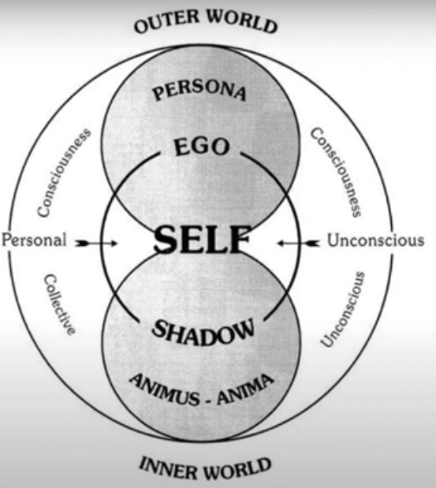

author: [[Max Derrat]]

càng đi xâu vào các chương sau thì trở nên khó nuốt hơn.

## AION - Cơn ác mộng của GS Peterson - Lời mở đầu

link: https://www.youtube.com/watch?v=N3ySHZviSss

nói về cơ ác mộn của [[Jordan  Peterson]] về cuốc sách aion gì đó của [[Carl Jung]] ,
tại sao nó trở thành cơ ác mộng của giáo sư,

thời ký khoảng 2000 năm trước, chòm sao,...
con người

## Aion Chương 1 BẢN NGÃ

### Ref

- Author: [[Max Derrat]]
- Link: https://www.youtube.com/watch?v=MJU0Xz-2ST8

### Note

</img>

 bản ngã (ego), có hai phần tâm trí và cơ thể,

 khi trẻ con sinh ra, chúng bị môi trường xung quanh tác động,
 chúng không thể tác động đến môi trường mà môi trường tác động đến nó
 khi trẻ con tiếp xúc với đồ chơi, chúng chơi với nó, ghép, quăng, đập,... chúng tác động đến môi trường nên chúng có bản ngã

 theo cách hiểu đơn giản nếu ta tác động với một tinh thần, cơ thể, thì bản ngã sẽ trỏi dạy,

 bản ngã chắc là hầu hết mọi người điều có, nó là điêu tốt, hay xấu tôi không biết

## Aion Chương 2 MẶT TỐI/ BÓNG ÂM

### Reference

- Author: [[Max Derrat]]
- Link: https://www.youtube.com/watch?v=Ja_Ik0hexBg

### Note

lấy ví dụ cái vòng âm dương, có mặt tối và mặt sáng

nhưng trong mọi vấn đề điều có mặt tối,

và mặt tối đó có thể chiếm lĩnh hoàng toàn mặt sáng

giống như chúa jesu chết một cách vô tội, người tốt chết

## Aion Chương 3 ANIMA và ANIMUS

### Reference

- Author: [[Max Derrat]]
- Link: https://www.youtube.com/watch?v=n-PBhsKNtEM

### Note

mỗi con người điều có phần tối và sáng
tiêu cực tích cực
nếu để tiêu cực đại diện cho cái tối nuốt thì con người bạn tối thui

anima và animus tồn tại trong người nam và nữ

người nữ tồn tại tính nam, lấy hình mẫu của tính nam đấy làm lý tưởng
họ  tìm kiếm tính nam, phù hợp với tính nam của họ, giống như idol,
họ cho thấy những mặt sáng của họ, và mặt sáng ấy lại phụ hợp với tính nam của của nũ,

giống như thần tượng, khi chúng ta thần tượng ai đó, vì thì họ phù hợp với tính anim.. của chúng ta, nếu ta thấy thần tượng mình có mặt tối giống như phạm tội hay gì đó, sẽ làm ta bị tiêu cực

## AION Chương 4 Tự ngã

### Reference

- Author: [[Max Derrat]]
- Link: https://www.youtube.com/watch?v=Si9PtKclpgc

### Note

tự ngã (seft),

tôi chưa hình dung được seft và ego khác nhau điểm nào,

về khoa học chứng minh được nhiều thứ, nhưng về vấn đề tâm linh khoa học chưa đủ để làm về vấn đề này
vì tâm linh được dựa trên cảm xúc,... của con người, khoa học vẫn chưa có cách để đo lường thí nghiệm nó
hy vọng tương lai sẽ có, giống như kỹ thuật đọc sống não trở nên okay hơn

và con người tìm một cái hình tượng seft của chính mình,
giống như đức tin vào chúa jesu vào phật chẳng hạn

trong cuốn sách thì chúa jesu có lẽ phù hợp

khi một vị chúa, thần tâm linh gì đó qua đời, không còn tồn tại thì những lý tưởng của họ  có thể biến chuyển, ,biến đổi theo dòng thời gian do con người, làm mất đi cái seft đáng tham khảo của họ,

## AION chương 5 - Đức Giê-su Biểu tượng của Tự ngã

### Reference

- Author: [[Max Derrat]]
- Link:
	- https://www.youtube.com/watch?v=mpImqHXUo3g
	- https://www.youtube.com/watch?v=_2_ed6moP3g

### Note

chúa jesus tồn tại với niềm tin của giáo đồ là một người sáng không có khúc tối nhưng jesus vẫn có góc tối
biểu tượng thánh giá và thánh giá lật ngược thường thấy trong mấy bộ phim trừ tà, khi ma quỷ hiện lên hay gì đó thì thánh giá lật ngược lại
giống như đầu trên thánh giá là thánh, còn đầu dưới là biểu hiện cho ác quỷ cái nào lên cao thì nó tồn tại.

như vậy thánh giá vẫn có mặt sáng và tối

giống như vòng am dương trong mấy phim trung quốc các kiểu

trong sáng tồn tại tối, trong tối lại tồn tại sáng

## AION Chương 6 Hình tượng song ngư

### Reference

- Author: [[Max Derrat]]
- Link: https://www.youtube.com/watch?v=XIBMK4_lZIg

### Note

chúa jesus là hình mẫu tối thượng mà con người muốn hướng đến

về chiêm tin học, khi 2 hoặc nhiều chòm sao thẳng hàng, thì sẽ có sự kiện lớn xẫy ra,
dấu mốc 500 năm, xẩy ra những sự kiện tiêu cực lẫn thích cực

chúa jesus được biểu tượng là con cá

## Aion chương 7 - Những lời tiên tri của Nostradamus

### Reference

- Author: [[Max Derrat]]
- Link: https://www.youtube.com/watch?v=1ffvFU-iLqU

### Note

củng cố niềm tin về chiêm tin học
lời tiên tri của một nhà chiêm tin học
đã xãy ra gần đúng như tiên tri
